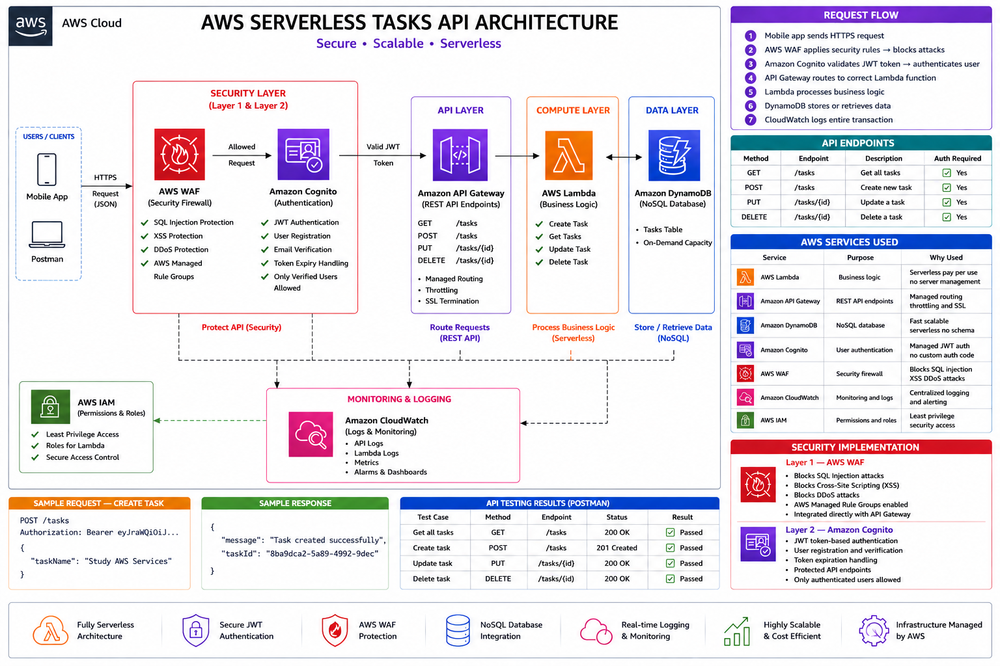

# 🚀 AWS Serverless Tasks API

> A production-ready serverless REST API built on AWS — demonstrating real-world cloud architecture with authentication, security, scalability and monitoring.

## 📌 Project Overview

This project implements a complete serverless backend for a Task Management application using AWS managed services. It demonstrates enterprise-level cloud architecture including:

- ✅ Serverless compute with AWS Lambda
- ✅ REST API with Amazon API Gateway
- ✅ NoSQL database with Amazon DynamoDB
- ✅ User authentication with Amazon Cognito
- ✅ Security protection with AWS WAF
- ✅ Monitoring with Amazon CloudWatch
- ✅ Infrastructure security with AWS IAM

## 🏗️ Architecture



### Request Flow:
```
1. Mobile app sends HTTPS request
2. WAF applies security rules → blocks attacks
3. Cognito validates JWT token → authenticates user
4. API Gateway routes to correct Lambda function
5. Lambda processes business logic
6. DynamoDB stores or retrieves data
7. CloudWatch logs entire transaction
```

## 🛠️ AWS Services Used

| Service | Purpose | Why Used |
|---------|---------|----------|
| **AWS Lambda** | Business logic | Serverless pay per use no server management |
| **Amazon API Gateway** | REST API endpoints | Managed routing throttling and SSL |
| **Amazon DynamoDB** | NoSQL database | Fast scalable serverless no schema |
| **Amazon Cognito** | User authentication | Managed JWT auth no custom auth code |
| **AWS WAF** | Security firewall | Blocks SQL injection XSS DDoS attacks |
| **Amazon CloudWatch** | Monitoring and logs | Centralized logging and alerting |
| **AWS IAM** | Permissions and roles | Least privilege security access |

## 📋 API Endpoints

| Method | Endpoint | Description | Auth Required |
|--------|---------|-------------|--------------|
| `GET` | `/tasks` | Get all tasks | ✅ Yes |
| `POST` | `/tasks` | Create new task | ✅ Yes |
| `PUT` | `/tasks/{id}` | Update a task | ✅ Yes |
| `DELETE` | `/tasks/{id}` | Delete a task | ✅ Yes |

### Sample Request — Create Task:
```json
POST /tasks
Authorization: Bearer eyJraWQiOiJ...

{
    "taskName": "Study AWS Services"
}
```

### Sample Response:
```json
{
    "message": "Task created successfully",
    "taskId": "8ba9dca2-5a89-4992-9dec"
}
```

## 🔒 Security Implementation

### Two Layers of Security:

**Layer 1 — AWS WAF:**
- Blocks SQL injection attacks
- Blocks cross-site scripting XSS
- Blocks DDoS attacks
- AWS Managed Rule Groups applied
- Attached directly to API Gateway

**Layer 2 — Amazon Cognito:**
- JWT token based authentication
- User registration and email verification
- Token expiry management
- Only verified users can access API
- Every endpoint protected

## 📁 Project Structure

```
aws-serverless-tasks-api/
├── architecture/
│   └── architecture.png
├── lambda/
│   ├── createTask/
│   │   └── lambda_function.py
│   ├── getTasks/
│   │   └── lambda_function.py
│   ├── deleteTask/
│   │   └── lambda_function.py
│   ├── updateTask/
│   │   └── lambda_function.py
│   └── getAuthToken/
│       └── lambda_function.py
├── screenshots/
│   └── all AWS service screenshots
├── .gitignore
├── LICENSE
└── README.md
```

## 🧪 API Testing Results

All endpoints tested using **Postman** with JWT Bearer Token authentication:

| Test | Method | Endpoint | Status | Result |
|------|--------|---------|--------|--------|
| Get all tasks | GET | /tasks | `200 OK` | ✅ Passed |
| Create new task | POST | /tasks | `201 Created` | ✅ Passed |
| Update task status | PUT | /tasks/{id} | `200 OK` | ✅ Passed |
| Delete task | DELETE | /tasks/{id} | `200 OK` | ✅ Passed |

## 🚧 Challenges and Solutions

### Challenge 1 — Cognito SECRET_HASH Error 🔐

**Problem:**
```
NotAuthorizedException: Client is configured
with secret but SECRET_HASH was not received
```

**Root Cause:**
AWS Cognito App Client had a client secret configured.
Every authentication request requires a SECRET_HASH
calculated using HMAC-SHA256 algorithm combining
username, client ID and client secret.

**Solution:**
```python
def get_secret_hash(username, client_id, client_secret):
    message = username + client_id
    dig = hmac.new(
        client_secret.encode('utf-8'),
        msg=message.encode('utf-8'),
        digestmod=hashlib.sha256
    ).digest()
    return base64.b64encode(dig).decode()
```

**Key Learning:**
Always handle Cognito client secrets properly.
Understanding AWS security mechanisms is crucial
for building production ready applications.

---

### Challenge 2 — Cognito FORCE_CHANGE_PASSWORD State 👤

**Problem:**
```
AuthenticationResult key not found
User stuck in FORCE_CHANGE_PASSWORD status
Login kept failing after user creation
```

**Root Cause:**
New users created via AWS Console are placed in
FORCE_CHANGE_PASSWORD state by default.
They cannot authenticate until password
is permanently confirmed.

**Solution:**
```bash
aws cognito-idp admin-set-user-password \
--user-pool-id us-east-1_xxxxxxxxx \
--username user@email.com \
--password Password@123 \
--permanent \
--region us-east-1
```

**Key Learning:**
Understanding Cognito user lifecycle states
is essential for proper user management.
In production always use email verification
flow for proper user confirmation.

---

### Challenge 3 — JWT Token Expiry During Testing 🔑

**Problem:**
```
401 Unauthorized
The incoming token has expired
```

**Root Cause:**
Cognito JWT ID tokens expire after 1 hour.
Long testing sessions caused token expiry
resulting in authentication failures across
all API endpoints.

**Solution:**
Created dedicated getAuthToken Lambda function
to generate fresh tokens on demand:
```python
response = client.initiate_auth(
    ClientId=client_id,
    AuthFlow='USER_PASSWORD_AUTH',
    AuthParameters={
        'USERNAME': username,
        'PASSWORD': password,
        'SECRET_HASH': secret_hash
    }
)
token = response['AuthenticationResult']['IdToken']
```

**Key Learning:**
In production applications always implement
token refresh mechanism using Cognito
refresh tokens which last 30 days.
This ensures seamless user experience
without frequent re-authentication.

## 🚀 How to Deploy

### Prerequisites:
- AWS Account
- Python 3.12
- AWS CLI configured

### Step by Step Deployment:

**Step 1 — Create DynamoDB Table:**
```
Table name: Tasks
Partition key: id (String)
Settings: Default
```

**Step 2 — Create IAM Role:**
```
Role name: lambda-dynamodb-role
Policies:
→ AmazonDynamoDBFullAccess
→ AWSLambdaBasicExecutionRole
→ AmazonCognitoPowerUser
```

**Step 3 — Deploy Lambda Functions:**
```
Runtime: Python 3.12
Role: lambda-dynamodb-role
Functions: createTask getTasks deleteTask updateTask getAuthToken
```

**Step 4 — Set Up Cognito:**
```
User Pool: TasksUserPool
Sign in method: Email
App Client: TasksApp
Auth flow: ALLOW_USER_PASSWORD_AUTH
```

**Step 5 — Configure API Gateway:**
```
Type: REST API
Resources: /tasks and /tasks/{id}
Methods: GET POST PUT DELETE
Authorizer: Cognito TasksAuthorizer
Stage: dev
```

**Step 6 — Enable WAF:**
```
Web ACL: TasksAPIProtection
Resource type: Regional
Associate with: API Gateway dev stage
Rules: AWS Managed Rules
```

## 📊 Key Learnings

```
✅ Serverless architecture design and implementation
✅ REST API development with API Gateway
✅ NoSQL database modeling with DynamoDB
✅ JWT authentication with Cognito
✅ Two layer security with WAF and Cognito
✅ API testing with Postman
✅ AWS IAM least privilege permissions
✅ CloudWatch monitoring and logging
✅ Git version control workflow
✅ Technical problem solving and debugging
```

## 🎯 Real World Applications

This serverless architecture is used by companies for:

| Use Case | Example |
|----------|---------|
| Mobile app backends | Ride sharing apps |
| IoT data processing | Smart home devices |
| E-commerce APIs | Online shopping carts |
| Real-time analytics | Live dashboards |
| Microservices | Large scale applications |

## 📸 Project Screenshots

All AWS service screenshots available
in the /screenshots folder showing:

| Screenshot | What it Proves |
|-----------|---------------|
| Lambda Functions | All 5 functions deployed |
| DynamoDB Table | Data storage working |
| API Gateway | REST API configured |
| Cognito User Pool | Authentication setup |
| WAF Protection | Security enabled |
| CloudWatch Logs | Monitoring active |
| IAM Role | Permissions configured |
| Postman Tests | All 4 endpoints working |

## 👨‍💻 Author

**Muralidharan M.N**
🎯 Cloud and DevOps Engineer

## 📄 License

MIT License — feel free to use this project for learning!